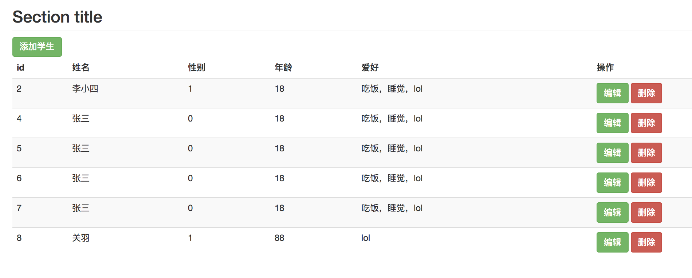
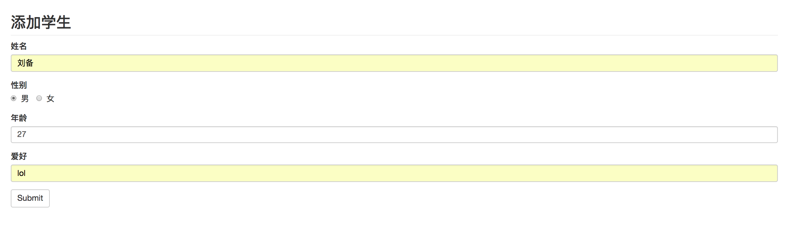
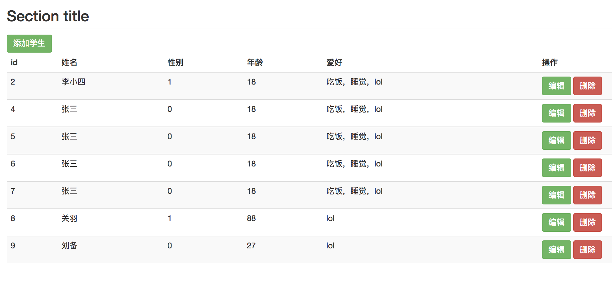
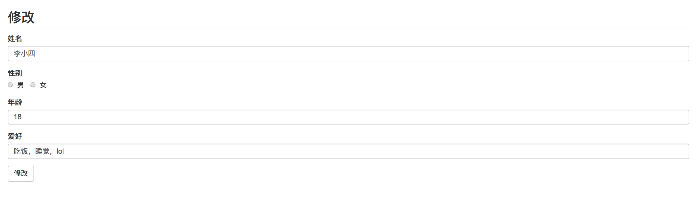

# CRUD增删改查（基于json的文件数据）

## 技术栈

- Node
- Express
- Nodemon

## 实现功能

- 学生列表增删改查
- 通过路由收到请求(router.js)
- 接受请求中的数据（get，post）
  - req.query
  - req.body
- 自己写的数据操作文件（student.js）
  - 封装异步 API
  - 异步编程回调函数

## 路由设计

|          |                  |          |                                |                  |
| -------- | ---------------- | -------- | ------------------------------ | ---------------- |
| 请求方法 | 请求路径         | get 参数 | post 参数                      | 备注             |
| GET      | /studens         |          |                                | 渲染首页         |
| GET      | /students/new    |          |                                | 渲染添加学生页面 |
| POST     | /studens/new     |          | name、age、gender、hobbies     | 处理添加学生请求 |
| GET      | /students/edit   | id       |                                | 渲染编辑页面     |
| POST     | /studens/edit    |          | id、name、age、gender、hobbies | 处理编辑请求     |
| GET      | /students/delete | id       |                                | 处理删除请求     |

## 项目截图

  - ### 首页

  - ### 添加页面

  - ### 添加后的首页

  - ### 修改
  